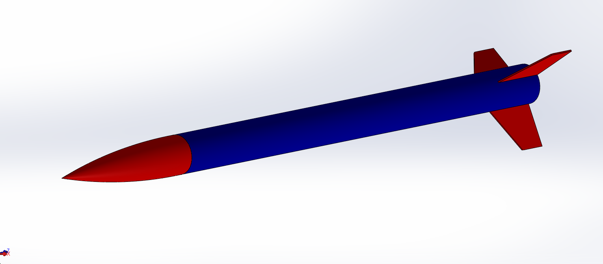
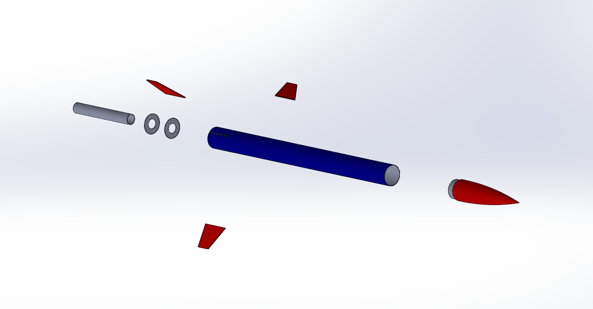
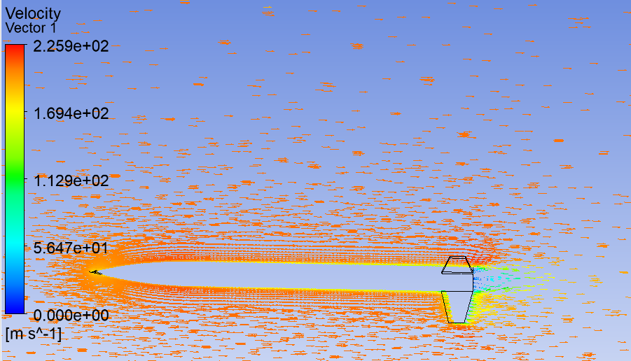
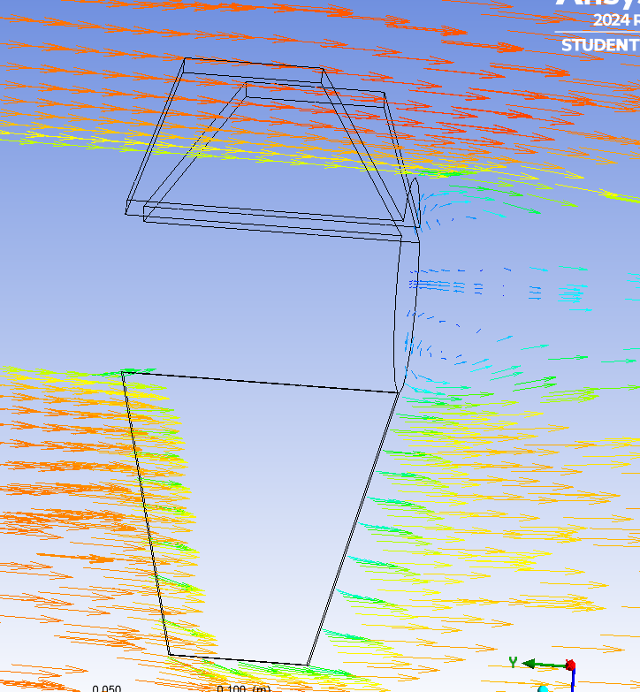
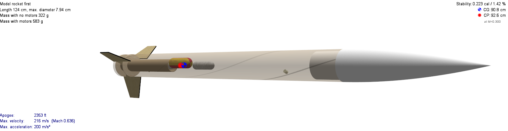
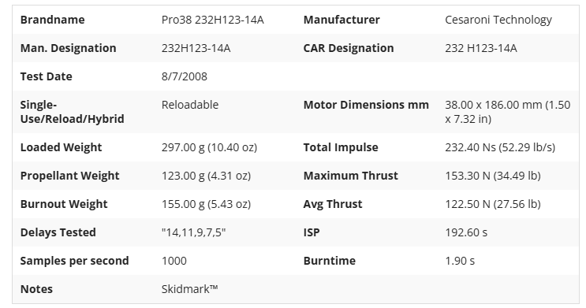

# Analysis record

## CAD and assembly evidence

The supplied CAD image shows the high-level vehicle arrangement: a nose cone, cylindrical body, fin set, and an external feature near the aft section. The accompanying exploded view separates the major parts and shows that the assembly was considered as a system rather than as an exterior shape alone.

The original CAD file and dimensioned fabrication drawings were not supplied, so this repository does not infer material selection, wall thickness, joint design, or manufacturing tolerances.

## Aerodynamic studies

The project summary identifies ANSYS as the tool used for aerodynamic shape optimization. The two supplied flow-visualization images document separate checks of the body and fin geometry.

| Study | Evidence | Supported observation |
|---|---|---|
| Body flow | [Body CFD](images/05-body-cfd.png) | Flow visualization around the body and aft geometry |
| Fin flow | [Fin CFD](images/06-fin-cfd.png) | Flow visualization around a fin and local aft-body region |

Mesh settings, boundary conditions, solver convergence, drag coefficients, and quantitative comparison data were not supplied. The images therefore document the analysis workflow, not a validated aerodynamic-performance value.

## OpenRocket simulation snapshot

The supplied OpenRocket image records the following model output:

| Model item | Value shown in the snapshot | Status |
|---|---:|---|
| Overall length | 142 cm | Simulation input |
| Maximum diameter | 7.94 cm | Simulation input |
| Mass without motor | 322 g | Simulation input |
| Mass with motor | 583 g | Simulation input |
| Predicted apogee | 2,353 ft | Simulation output |
| Maximum velocity | 216 m/s (Mach 0.636) | Simulation output |
| Maximum acceleration | 200 m/s² | Simulation output |

The OpenRocket project file and an independently exported flight report were not supplied. These values are kept as a model snapshot and are not treated as measured flight data.

## Commercial motor reference

The supplied specification image identifies a Cesaroni Technology commercial reloadable motor reference. It is included as a component-selection record only; the repository does not provide manufacturing, reloading, modification, or operational instructions.

