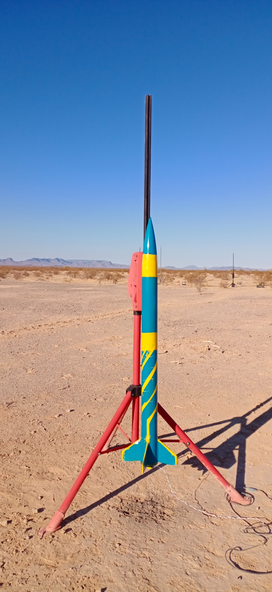
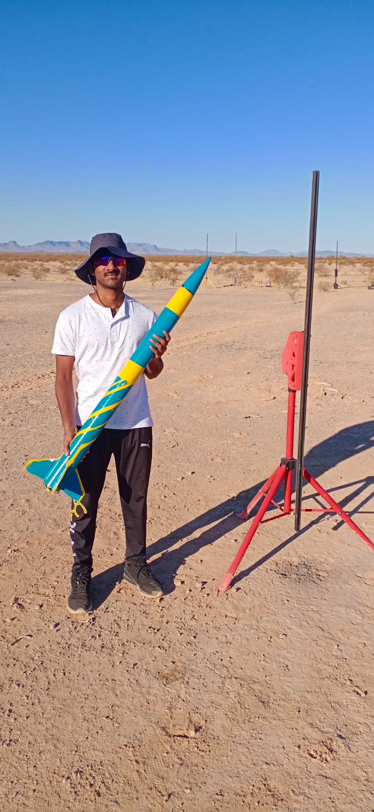

# Flight record

## Evidence supplied

- [Public demonstration video](https://www.youtube.com/watch?v=sOgIDCdu4OA): titled *High Power Rocket Design with Apogee of 1800ft*.
- Launch-site photograph showing the vehicle installed on the rail.
- Field photograph of the vehicle and launch equipment.
- Project-summary image identifying the project as **SEDS Rocketry ASU** and reporting the flight outcome.

## Reported versus measured data

| Item | Evidence source | How it is described here |
|---|---|---|
| Apogee | YouTube title: 1,800 ft; project summary: 1,900 ft | Reported 1.8-1.9 kft apogee |
| Peak speed | Project summary: Mach 0.6 | Project-reported peak near Mach 0.6 |
| Descent | Project summary: controlled descent | Project-reported outcome |

No flight-computer log, altimeter export, GPS track, independent tracking record, or recovery log was supplied. Those items would be needed to state a single verified apogee or other measured flight-performance values.
